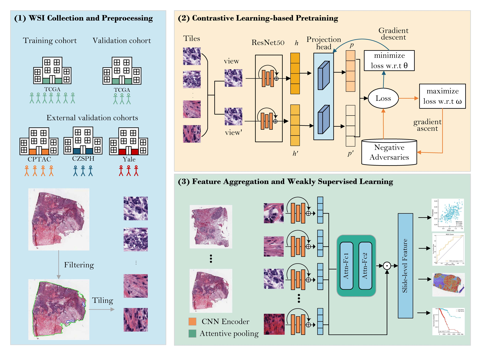

# Weakly supervised contrastive learning infers molecular subtypes and recurrence risk of breast cancer from pathology images 

The model include three stages. Firstly,  [Adco](https://arxiv.org/abs/2011.08435) is trained to extract tile-level features, then the attention-pooling is used to aggregate 
tile-level features into slide-level features, and finally it is used in the downstream tasks, including tumor diagnosis, gene expression level prediction,
molecular subtyping, recurrence risk prediction, and drug response prediction, as well as a prognostic risk score.


## WSI segmentation and tiling
You can download your own wsi dataset to the directory slides, then run process_data/create_patches_fp.py to segment and split WSIs, adjust the parameters according to your needs.
For example, you can use following command for segmention and tiling.
``` shell
python create_patches_fp.py --source ../slides/TCGA-BRCA  --patch_size 256 --save_dir ../tile_results --patch --seg --tcga_flag
```  
When you run this command, it will run in default parameter, if you want to run with your parameter, you can modify tcga.csv in directory preset, and add ```--preset ../preset/tcga_brca.csv```.
Then the coordinate files will be saved to ```tile_results/patches``` and the mask files that show contours of slides will be saved to ```tile_results/masks```.
Based on the previous step, you can randomly sample tiles for next step.
``` shell
python save_tiles.py --patch_size 256 --sample_number 100 --save_dir ../tiles_result
```  

## Training contrastive learning model
Run train_adco.py to train contrast learning model on tiles,
you should write Adco/ops/argparser.py to configure the data source and the save address and ADCO related parameters firstly.
For example, you can use following command for training ADCO model with default parameter.  
``` shell
python3 train_adco.py --dist_url=tcp://localhost:10001 --data ../tiles_result/tiles_40x --save_path ../MODELS_SAVE --model_path ../MODELS_SAVE
```  

## Extracting tile-level features
Run process_data/extract_features_fp.py to extract the tile-level features. For example, you can use following command:
``` shell
python extract_features_fp.py --data_h5_dir ../tile_results --data_slide_dir ../slides/TCGA-BRCA --csv_path ../dataset_csv/sample_data.csv --feat_dir ../FEATURES --data_type tcga_brca --model_path ../MODELS_SAVE/adco_tcga.pth.tar
```  
The above command will use the trained ADCO model in ```model_path``` to extract tile features in ```data_slide_dir```
and save the features to ```feat_dir```. 


## Training gene expression level
Run train/train_gene.py to perform downstream regression task such as prediction of  gene expression level. For example:  
``` shell
python train_gene.py --lr 0.0003 --epochs 30 --K 3 --model_type clam_mb --feature_path ../FEATURES --label all --save_path ../RESULTS
```  
The above command will train regression that using attention-pooling to aggregate tile features by default. User should prepare gene dataset like this:  
``` bash
dataset_csv/gene
	     ├── train_dataset_1.csv
	     ├── ...
	     ├── train_dataset_3.csv
	     ├── test_dataset_1.csv
	     ├── ...
	     ├── test_dataset_3.csv
	     ├── val_dataset_1.csv
	     ├── ...
	     ├── val_dataset_3.csv
```  
The training files is like dataset_csv/gene/sample_gene_dataset.csv.

## Training tumor diagnosis model
Run train/train_tumor.py to perform downstream classification task. For example:  
``` shell
python train_tumor.py --lr 0.0003 --epochs 30 --K 3 --model_type clam_sb --feature_path ../FEATURES --label tumor --save_path ../RESULTS
```  
The above command will train classification that using attention-pooling to aggregate tile features by default. User should prepare dataset like this:
``` bash
dataset_csv/tumor
	     ├── train_dataset_1.csv
	     ├── ...
	     ├── train_dataset_3.csv
	     ├── test_dataset_1.csv
	     ├── ...
	     ├── test_dataset_3.csv
	     ├── val_dataset_1.csv
	     ├── ...
	     ├── val_dataset_3.csv
```


